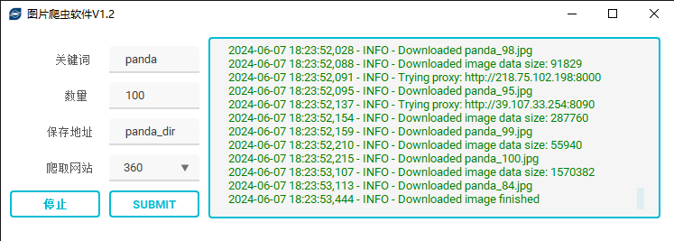
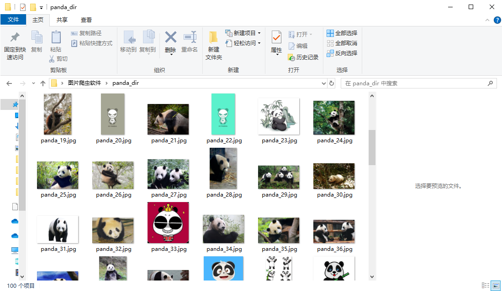

# Crawler

- **Version**: V1.3

## 作者

- **Author**: Zhang Yuetao
- **GitHub**: [VerySeriousMan](https://github.com/VerySeriousMan)

## 项目简介

Crawler 是一个用于抓取百度图片的工具。该工具提供了一个简单易用的图形用户界面（GUI），用户可以通过输入关键词，指定下载数量和保存位置，快速地下载百度图片搜索结果。

## 功能介绍

- **关键词搜索**: 通过输入关键词，从百度图片搜索中获取相关图片。
- **以图搜图**: 通过导入图片，从百度图片搜索中获取与导入图片相似的图片。（关闭）
- **数量限制**: 用户可以指定要下载的图片数量。
- **保存位置**: 用户可以选择图片下载保存的文件夹。
- **日志记录**: 实时显示下载过程中的日志信息，包括下载进度、错误信息等，且日志信息不同级别显示不同颜色，便于查看。
- **IP池获取**: 用户可以刷新可用IP池，软件会实时爬取新的可用IP。(关闭)
- **爬取网站选择**: 用户可以选择爬取的网站，现支持百度、搜狗、必应、360图片搜索。
- **多线程爬取与爬取速度选择**: 用户可以选择爬取的间隔速度与启用多线程并选择多线程数量进行爬取。

## 反爬机制

为了应对反爬机制，我们实现了以下措施：

- **随机延时**: 在发送请求时，随机延时一段时间，以模拟人类操作，降低被封禁的风险。
- **用户代理池**: 使用多个随机的用户代理（User-Agent）来发送请求，减少被识别为机器人的概率。
- **代理 IP 池**: 使用多个随机的代理 IP 地址来发送请求，防止 IP 被封禁。

## 环境依赖

- Python 3.x
- PyQt5
- qt_material
- requests
- colorlog
- chardet
- beautifulsoup4
- toml

## 版本更新日志
### V1.3（2024.11.18）
1. **新增软件自动更新功能**
   - ① 自动版本检测：打开软件后会自动检测服务器连接情况，若成功连接，会进行版本比对以判断是否需要更新
   - ② 自动更新：需要更新情况下，打开软件时会自动弹出信息，用户可选择是否立即更新，更新时软件会自动进行新版本所需全部文件的下载、替换
   - ③ 自动切换到新版本：软件更新完毕后，会自动切换到新版本软件并删除旧版本内容，并弹出更新日志，用户可正常使用新版本软件
2. **新增菜单栏与版本检测功能功能**
   - ① 用户可点击菜单栏中版本检查功能进行软件版本检测与更新
3. **优化界面显示与文件保存**
   - ① 增加界面布局
   - ② 优化文件夹名输入提示
   - ③ 保存文件名增加爬取网站信息防止重复

## 示例图

### 软件界面示例

### 爬取图片示例

## 贡献
如果你有好的建议或发现了问题，欢迎提交 issue 或 pull request。
